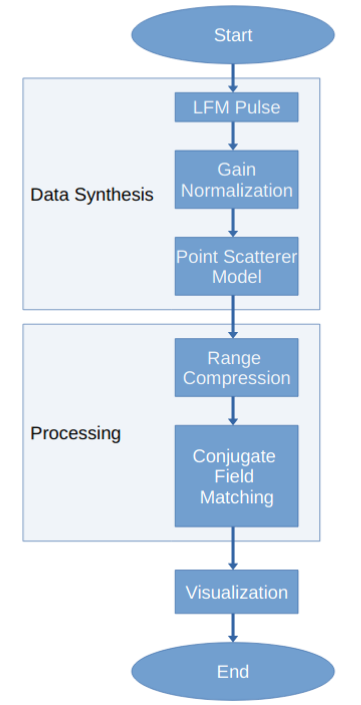
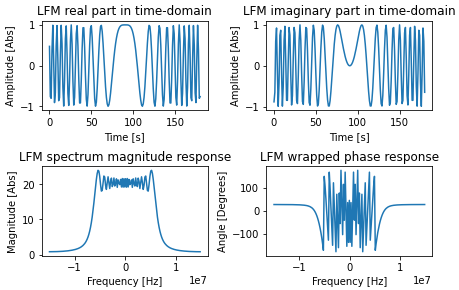
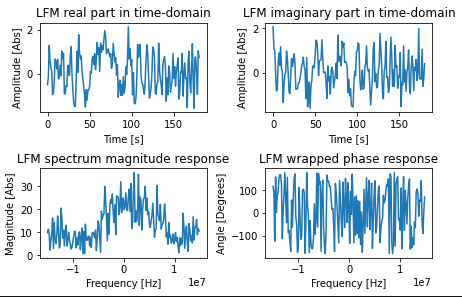
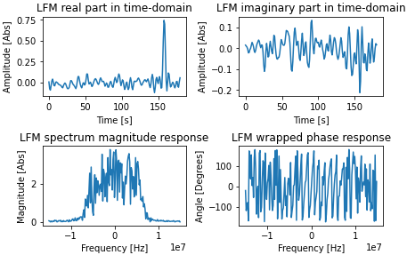
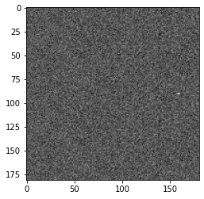

# Digital-Beam-Forming-for-spaceborne-Reflector-SAR
This notebook reproduces the results of this paper published in the Proceedings of the 6th European Radar Conference: 

[A novel Digital Beam-Forming Concept for spaceborne Reflector SAR Systems](https://ieeexplore.ieee.org/abstract/document/5306998)

The model used to generate data for demonstrating the results of the paper was taken from this book by Bu-Chin Wang:

[Digital Signal Processing Techniques and Applications in Radar Signal Image Processing](https://www.wiley.com/en-us/Digital+Signal+Processing+Techniques+and+Applications+in+Radar+Image+Processing-p-9780470377826)

---

## Algorithm
<figure>
    

      
    

</figure> 

---
## Results

<figure>
    

      
        <figcaption>
            Local LFM Pulse
        </figcaption>
    

</figure> 

<figure>
    

      
        <figcaption>
            Local LFM Pulse with thermal noise
        </figcaption>
    

</figure> 

<figure>
    

      
        <figcaption>
            Point reflector model simulation along a channel
        </figcaption>
    

</figure> 

<figure>
    

      
        <figcaption>
            Synthesized terrain image
        </figcaption>
    

</figure> 
